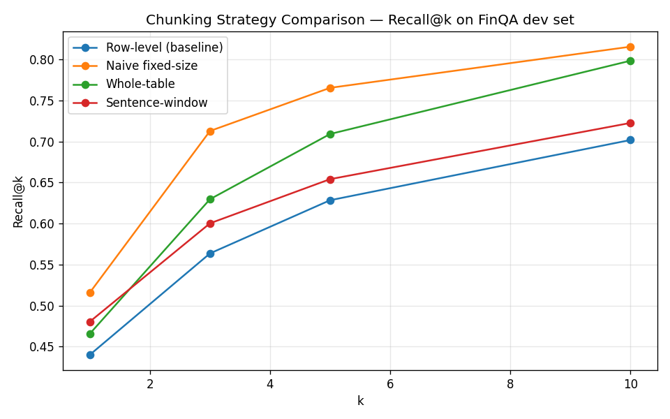

# Fin-Tech Q/A RAG Pipeline

A end-to-end RAG pipeline over the [FinQA](https://github.com/czyssrs/FinQA) development
split: ingest financial filings, compare chunking strategies, benchmark vector stores,
and answer questions with a local LLM.

The central finding: **retrieval metrics and answer accuracy disagree**. Row-level
chunking retrieves most precisely, but **whole-table chunking answers the most
questions correctly** — because most FinQA questions need two cells from the same
table, and only a whole-table chunk hands the model both at once.

---

## Pipeline overview

```
dev.json
   │
   ▼  preprocessing (clean, reconstruct pages, row-level chunks, gold mapping)
documents.jsonl  chunks.jsonl  eval_dataset.jsonl
   │
   ▼  chunking lab (5 alternative strategies + row-group sweep + parent-child)
chunks_*.jsonl  eval_results_*.json
   │
   ▼  vector DB benchmark (FAISS vs ChromaDB vs Qdrant)
chroma_db/  qdrant_db/
   │
   ▼  RAG (whole-table chunks + Qdrant + Ollama)
question → retrieve top-k → generate → answer
```

| Stage | What it does | Entry point |
|---|---|---|
| **1. Preprocessing** | Load FinQA, clean text/tables index-preserving, group by page, build row-level chunks and eval gold map | `scripts/run_preprocessing.py`, `notebooks/01_preprocessing_eda.ipynb` |
| **2. Chunking lab** | Compare 6 chunking strategies on retrieval + generation | `scripts/build_chunking_strategies.py`, `notebooks/02_chunking_lab.ipynb` |
| **3. Vector DB** | Same embeddings, three stores — build time, search time, recall | `scripts/vector_db.py`, `notebooks/vectordB_and_embeddings.ipynb` |
| **4. RAG** | Production-style Q&A: embed question → Qdrant search → Ollama answer | `scripts/run_rag.py`, `src/rag/pipeline.py` |

---

## Results

### Chunking strategies (44-question stratified sample)

`BAAI/bge-small-en-v1.5` for retrieval, `qwen2.5:7b-instruct` (local Ollama) for
generation, top-k = 5.

| Strategy | Chunks | P@5 | R@5 | R@10 | **Answer accuracy** |
|---|---|---|---|---|---|
| Row-level (baseline) | 8,931 | 0.123 | 0.474 | 0.557 | 40.9% |
| Naive fixed-size (control) | 2,689 | 0.237 | 0.765 | 0.815 | 29.5% |
| **Whole-table** | 7,575 | 0.205 | 0.709 | 0.798 | **45.5%** |
| Sentence-window | 8,931 | 0.328 | 0.652 | 0.722 | 36.4% |
| Row-group-5 | 7,718 | — | — | — | (run `run_generation_eval.py`) |
| Parent-child | 8,931 index | — | — | — | (run `run_generation_eval.py`) |



The naive control has the best *retrieval* recall yet the worst *answer* accuracy.
Long character windows overlap enough text to score well on content-overlap matching
while still handing the model a blob it cannot compute from. That gap is the argument
for evaluating generation, not just retrieval.

### Table chunk size sweep (retrieval only, recall@5)

Row-level and whole-table are the two ends of one dial. Middle points measured with
`scripts/run_chunk_size_sweep.py` (818 questions with gold annotations):

| Rows per table chunk | Chunks | Recall@5 |
|---|---|---|
| 1 (row-level) | 8,931 | 62.8% |
| 2 | 8,189 | 67.7% |
| 3 | 7,918 | 70.4% |
| **5** | 7,718 | **71.3%** |
| whole table | 7,575 | 70.2% |

Recall climbs steeply from 1 to 3 rows and then flattens. Five rows edges out whole
table by ~1 pp — inside the noise on 818 questions.

### Vector DB benchmark (whole-table chunks, content-overlap recall@5)

Same 7,176 chunks and 883 questions, embeddings computed once:

| Tool | Build time | Search time (883 q) | Recall@5 |
|---|---|---|---|
| **FAISS** | ~0.00s | ~0.01s | 65.7% |
| ChromaDB | ~2.7s | ~0.2s | 65.6% |
| Qdrant | ~4.5s | ~5.2s | 65.7% |

All three tie on recall (same vectors, same math). FAISS is fastest but in-memory
only; ChromaDB and Qdrant persist to disk under `data/processed/`.

---

## The dataset problem this project is really about

FinQA labels gold evidence as **positional indices** — `ann_table_rows: [3]` means
the fourth row of the table, `ann_text_rows: [7]` means the eighth line of
`pre_text + post_text`. Three consequences drove most of the design:

**1. Cleaning cannot drop lines.** The corpus has ~400 lines that are a lone `.`,
and deleting them shifts every later index, silently repointing gold labels at the
wrong sentence. `index_preserving_clean` is one-line-in, one-line-out and only
*flags* `is_noise`; flagged chunks are excluded at index time instead.
Locked in by `tests/test_cleaning.py`.

**2. Pages repeat.** 883 questions cover only 299 distinct pages, so documents are
grouped by filename with a `qa_ids` backlink rather than embedded once per question.

**3. `exe_ans`, not `answer`, is ground truth.** The human-typed `answer` field is
rounded and occasionally unrelated (`answer: '1%'` where `exe_ans: 0.015`). Grading
against it would mark correct responses wrong. `answers_match` also handles percent
scale ambiguity and boolean `"yes"` / `"no"` questions.
Locked in by `tests/test_answer_matching.py`.

---

## Project layout

```
notebooks/
  01_preprocessing_eda.ipynb       # EDA + preprocessing narrative
  02_chunking_lab.ipynb            # strategy comparison (retrieval + generation)
  vectordB_and_embeddings.ipynb    # FAISS / ChromaDB / Qdrant + Simple RAG demo

src/
  data/          loader.py  cleaning.py  reconstruction.py
  chunking/      row_level.py  naive_fixed.py  whole_table.py  sentence_window.py
                 row_group.py  parent_child.py
  eval/          gold_mapping.py  retrieval_harness.py  generation_harness.py  sampling.py
  rag/           pipeline.py          # SimpleRAG: Qdrant + Ollama
  utils/         io.py                # load_jsonl, resolve paths from project root

scripts/
  run_preprocessing.py             # dev.json → documents, chunks, eval_dataset
  build_chunking_strategies.py     # strategies 2–5 → chunks_*.jsonl
  run_retrieval_eval.py            # embedding retrieval metrics
  run_chunk_size_sweep.py          # row-group granularity sweep
  run_generation_eval.py           # end-to-end LLM accuracy (needs Ollama)
  build_comparison_report.py       # summary table + recall@k chart
  vector_db.py                     # FAISS vs ChromaDB vs Qdrant benchmark
  run_rag.py                       # build index + ask questions

tests/                             # pytest suite pinning known bugs
data/
  raw/dev.json                     # FinQA dev split (read-only source)
  processed/                       # documents, chunk stores, eval results, vector DBs
```

Notebooks hold no logic — every function they call is imported from `src/`, so the
same code path runs interactively and in scripts.

---

## Chunk schema

Every strategy emits the same keys:

| Field | Meaning |
|---|---|
| `chunk_id` | `{doc_id}::{chunk_type}::{row_index}` |
| `chunk_type` | `table_row`, `text_line`, `whole_table`, `text_window`, `fixed_size`, `row_group` |
| `row_index` | Table rows count from 1 (row 0 is header); text lines index into `pre_text + post_text` |
| `text` | Linearized sentence, raw line, or character window |
| `is_noise` | Flagged junk line — kept for index alignment, excluded from retrieval |
| `doc_id` | Parent page, e.g. `V/2008/page_17.pdf` |

For row-level chunks, `row_index` matches FinQA's own indexing, so gold references
resolve to formatted `chunk_id` values with **0 unresolved references** in
`eval_dataset.jsonl`.

---

## Processed artifacts

| File | Purpose |
|---|---|
| `documents.jsonl` | One unique page per line (299 docs) |
| `chunks.jsonl` | Row-level baseline chunks (8,931) |
| `chunks_whole_table.jsonl` | Whole-table strategy (7,575) |
| `chunks_naive_fixed.jsonl` | 500-char fixed windows (2,689) |
| `chunks_sentence_window.jsonl` | Sentence-window text (8,931) |
| `chunks_grouped_5.jsonl` | 5 table rows per chunk (7,718) |
| `chunks_parent_child_index.jsonl` | Row-level index for parent-child retrieval |
| `eval_dataset.jsonl` | 883 questions with `gold_chunk_ids` |
| `gen_eval_sample.jsonl` | Fixed 44-question stratified sample for generation eval |
| `eval_results_*.json` | Per-strategy retrieval / generation scores |
| `qdrant_db_final/` | Production RAG vector index (whole-table chunks) |

---

## Two retrieval scorers

- **`evaluate_chunking_strategy`** — exact `chunk_id` match. Only meaningful within
  the row-level id scheme; a `whole_table` chunk can never equal a `table_row` gold id.
- **`evaluate_chunking_strategy_generic`** — content-overlap match, valid *across*
  granularities. Use this for cross-strategy comparison and vector DB benchmarks.

---

## Setup

```bash
# Python environment (conda recommended on Apple Silicon)
conda create -n finqa-rag python=3.12
conda activate finqa-rag

# FAISS: use conda on arm64 (pip wheel can segfault)
conda install -c conda-forge faiss-cpu numpy libgfortran

pip install -r requirements.txt

# Generation eval + RAG: local Ollama
ollama pull qwen2.5:7b-instruct
ollama serve   # if not already running
```

On Apple Silicon, set `device="cpu"` for SentenceTransformer (MPS can crash during
encode). The scripts already do this.

---

## Reproduce

Run from the project root:

```bash
# 1. Preprocessing
python scripts/run_preprocessing.py

# 2. Alternative chunk stores
python scripts/build_chunking_strategies.py

# 3. Retrieval evaluation (~5 min)
python scripts/run_retrieval_eval.py

# 4. Chunk size sweep (~2 min, embedding only)
python scripts/run_chunk_size_sweep.py

# 5. Generation evaluation (~20 min, needs Ollama)
python scripts/run_generation_eval.py

# 6. Summary table + chart
python scripts/build_comparison_report.py

# 7. Vector DB benchmark (~2 min)
python scripts/vector_db.py

# 8. RAG — build index once, then ask questions
python scripts/run_rag.py --setup
python scripts/run_rag.py --ask "what is the average payment volume per transaction for american express?"

# Tests
pytest
```

The sample in `gen_eval_sample.jsonl` is reused if present, so every strategy is
graded on identical questions across runs.

---

## RAG usage

```python
from src.rag.pipeline import SimpleRAG

rag = SimpleRAG()
rag.setup()                              # embed + index whole-table chunks → qdrant_db_final/
result = rag.ask("your question here")   # retrieve top-5 → Ollama → answer
print(result["answer"])
print(result["sources"])                 # retrieved chunk texts
rag.close()
```

Or from the CLI:

```bash
python scripts/run_rag.py --setup --ask "your question"
python scripts/run_rag.py --ask "another question"   # index already on disk
```

---

## Chunking strategies

| # | Strategy | Module | Idea |
|---|---|---|---|
| 1 | Row-level | `row_level.py` | One chunk per table row / text line — gold-aligned baseline |
| 2 | Naive fixed-size | `naive_fixed.py` | 500-char windows over flat text — structure-blind control |
| 3 | Whole-table | `whole_table.py` | Entire table as one chunk — best generation accuracy |
| 4 | Sentence-window | `sentence_window.py` | Text line ± 1 neighbour; table rows unchanged |
| 5 | Row-group-5 | `row_group.py` | Group 5 table rows per chunk |
| 6 | Parent-child | `parent_child.py` | Retrieve on row-level children, expand to whole parent table for LLM context |

---

## Known gaps

- **`retrieval_hit_rate` in generation eval uses exact id matching**, so it is not
  comparable across strategies with different id schemes. It does not affect
  `accuracy`. Parent-child uses row-level ids, so its hit rate *is* comparable to
  strategy 1.
- **`clean_line` only tightens parentheses around digits** — `( billions )` stays
  spaced on ~2,100 lines. Pinned by test rather than silently rewritten.
- **65 of 883 questions carry no gold rows** in FinQA's annotations.
- Single embedding model, single judge LLM, one seed. Accuracy gaps between adjacent
  strategies are a few percentage points on 44 questions — treat ordering of the
  middle two as suggestive, not settled.
- **FAISS is in-memory only** in the current RAG path; production index uses Qdrant
  on disk.

---

## At 10x scale

- Persist embeddings; swap brute-force dot product for ANN (FAISS HNSW or pgvector).
- Add BM25 hybrid retrieval — financial questions lean on exact tokens (tickers,
  fiscal years, line-item names).
- Batch/concurrent LLM calls; generation eval currently dominates wall-clock time.
- Cache per-document chunk output keyed by content hash.

---

## Data

FinQA (Chen et al., EMNLP 2021), dev split only. Source:
[czyssrs/FinQA](https://github.com/czyssrs/FinQA).
